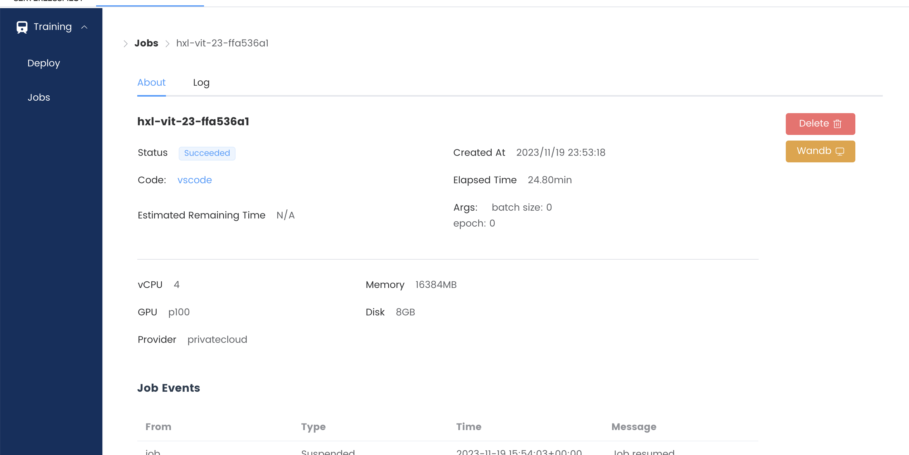
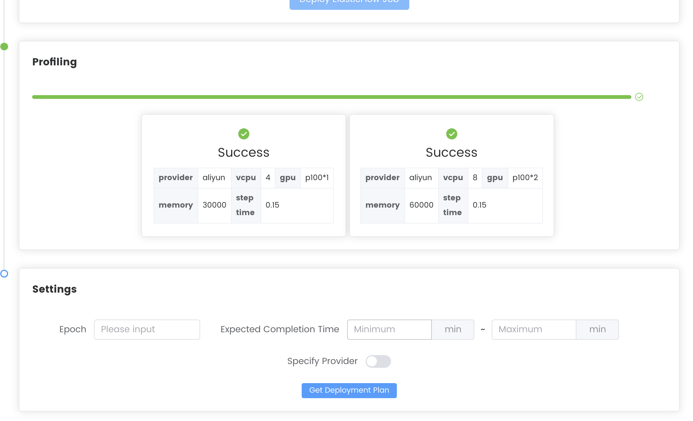
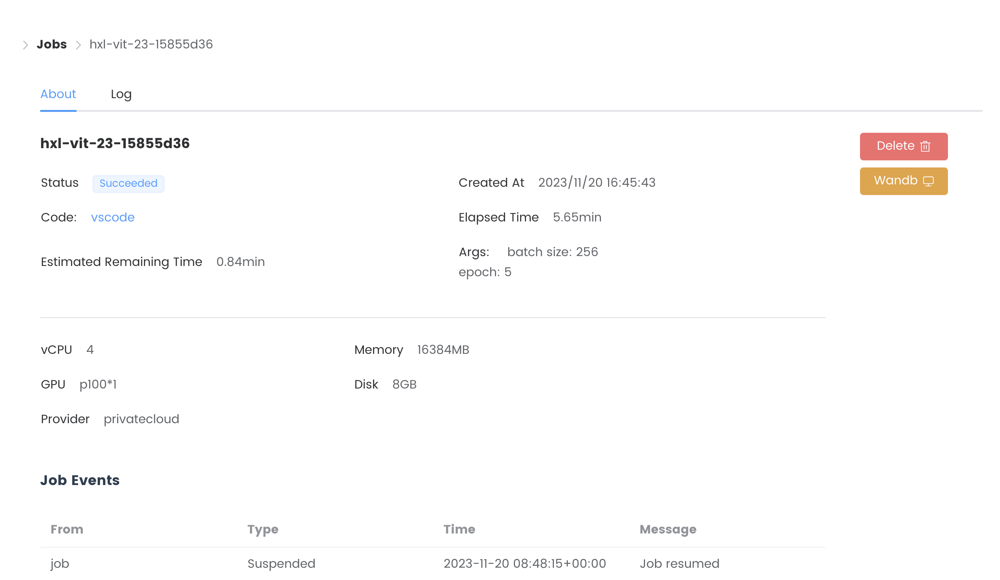

# 分布式机器学习理论与系统 第一次作业

## 模型及数据集选择

本仓库实现了一个简化的 Vision Transformer (ViT)，在 CIFAR-100 数据集上进行训练。

## 代码结构

本仓库基于 [wecloud_train](https://github.com/qipengwang/wecloud_train) ，在此基础上新增了 ViT 模型，并添加了对分布式训练的支持。

```bash
.
├── README.md
├── models              # 可以选择的模型
│   ├── vit.py          # ViT 模型实现
│   ...
├── .spilot.yaml        # ServerlessPilot 配置文件
├── train.py            # 训练脚本，新增了对分布式训练的支持
│── utils.py            # 帮助函数，新增了对分布式训练的支持
...
```

## 实验

### 任务创建

使用 [wecloud-cli-py](https://github.com/wecloudless/wecloud-cli-py/) 将代码上传到 ServerlessPilot

```bash
cd wecloud-cli-py
python main.py deploy --path .. --job hxl-vit-23
```

### Naive Job 部署

在 ServerlessPilot 平台上部署 Naive Job，配置为 4 vCPU, 2 GPU，运行成功。



### Profiling

在 ServrelessPilot 平台上选择 "Deploy ElasticFlow Job"，等待 Profiling 完成。



### ElasticFlow Job 部署

在 ServerlessPilot 平台上部署 ElasticFlow Job，运行成功。




## 建议

1. 当前 Profiling 中程序的输出不可见，Profiling 出错时的表现为 Profiling 无法结束。这使得用户无法定位错误原因。建议完善 Profiling 的日志输出。

2. 当前平台上的任务默认按照任务 ID 排序，建议增加按照任务创建时间排序的功能。